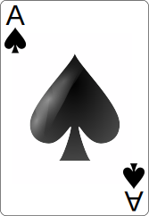

# SVG Playing Cards

A set of svg playing cards and a card back.  I did not create these, but combined them for a project and am redistributing them here in the event anyone else is looking for the exact same thing for a project.  Credits are as follows:

- Card Fronts : [https://github.com/notpeter/Vector-Playing-Cards](https://github.com/notpeter/Vector-Playing-Cards) (which is itself a fork of [https://code.google.com/p/vector-playing-cards/](https://code.google.com/p/vector-playing-cards/))

- Card Backs : [https://commons.wikimedia.org/wiki/File:Card_back_01.svg](https://commons.wikimedia.org/wiki/File:Card_back_01.svg)

Enjoy!
